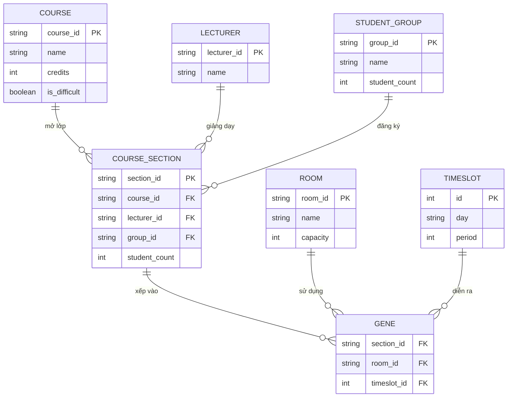

# Sơ Đồ ERD & Mô Hình Hóa Bài Toán Xếp Thời Khóa Biểu

```mermaid
erDiagram
    COURSE ||--o{ COURSE_SECTION : "mở lớp"
    LECTURER ||--o{ COURSE_SECTION : "giảng dạy"
    STUDENT_GROUP ||--o{ COURSE_SECTION : "đăng ký"
    COURSE_SECTION ||--o{ GENE : "xếp vào"
    ROOM ||--o{ GENE : "sử dụng"
    TIMESLOT ||--o{ GENE : "diễn ra"

    COURSE {
        string course_id PK
        string name
        int credits
        boolean is_difficult
    }

    COURSE_SECTION {
        string section_id PK
        string course_id FK
        string lecturer_id FK
        string group_id FK
        int student_count
    }

    LECTURER {
        string lecturer_id PK
        string name
    }

    STUDENT_GROUP {
        string group_id PK
        string name
        int student_count
    }

    ROOM {
        string room_id PK
        string name
        int capacity
    }

    TIMESLOT {
        int id PK
        string day
        int period
    }

    GENE {
        string section_id FK
        string room_id FK
        int timeslot_id FK
    }
```
