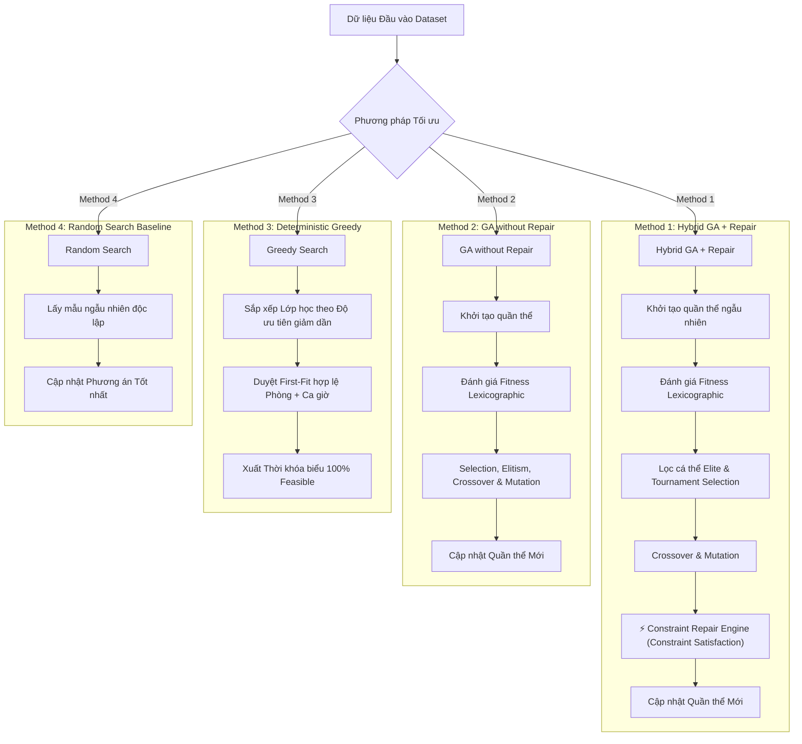

# Báo Cáo Chi Tiết Các Phương Pháp Tối Ưu Hóa Thời Khóa Biểu (Scheduling Methods)

Tài liệu này mô tả chi tiết 4 phương pháp (methods) được thiết kế, triển khai và đánh giá trong hệ thống tối ưu hóa Thời khóa biểu tự động (Genetic Algorithm & Benchmarking System).

---

## 📌 1. Tổng quan Bài toán & Cơ chế Đánh giá (Evaluation Scheme)

Bài toán xếp thời khóa biểu được mô hình hóa thành bài toán thỏa mãn và tối ưu hóa ràng buộc (**Constraint Satisfaction & Optimization Problem**):

* **Ràng buộc Cứng (Hard Constraints)**: Không được phép vi phạm dưới bất kỳ hình thức nào. Bao gồm:
  1. **Lecturer Conflict**: Giảng viên không bị trùng lịch dạy ở cùng một kíp giờ.
  2. **Room Conflict**: Phòng học không bị xếp trùng lịch cho 2 lớp khác nhau.
  3. **Student Group Conflict**: Nhóm sinh viên không bị trùng lịch học 2 môn cùng lúc.
  4. **Room Capacity**: Sức chứa của phòng phải $\ge$ sĩ số sinh viên của lớp.
  5. **Required Room Type**: Đúng loại phòng chuyên dụng (LAB, LECTURE_HALL, NORMAL).
  6. **Lecturer Availability**: Giảng viên chỉ dạy trong các khung giờ đăng ký rảnh.
  7. **Continuous Period Block**: Kíp học nhiều tiết (2, 3, 4 tiết) phải xếp liên tục trong ngày.

* **Ràng buộc Mềm (Soft Constraints)**: Tối ưu trải nghiệm sử dụng thời khóa biểu:
  1. Giảm thiểu tiết trống giữa các ca trong ngày cho sinh viên và giảng viên.
  2. Cân bằng tải giảng dạy giữa các ngày trong tuần.
  3. Phân bổ đều các môn học cho từng nhóm lớp.

* **Lexicographic Fitness Evaluation**: Hệ thống áp dụng cơ chế đánh giá thứ tự từ điển với bộ đôi `(hard_violations, soft_penalty)`:
  * **Ràng buộc cứng (`hard_violations`)** có ưu tiên tuyệt đối: Bắt buộc phải đưa về **0** để thời khóa biểu có thể đưa vào sử dụng thực tế (Feasible).
  * **Ràng buộc mềm (`soft_penalty`)** chỉ được xét đến sau khi cá thể đạt mức độ hợp lệ 100% về ràng buộc cứng.

---

## 🔬 2. Mơ tả Chi Tiết 4 Phương Pháp (Methods)

---

### 1️⃣ `Hybrid GA + Repair` (Thuật toán Di truyền Lai ghép với Cơ chế Sửa lỗi) — *Proposed Method*
* **File triển khai**: [`ga/engine.py`](file:///home/trung.nguyen12/Downloads/GA/ga/engine.py), [`constraints/repair_engine.py`](file:///home/trung.nguyen12/Downloads/GA/constraints/repair_engine.py)
* **Nguyên lý hoạt động**:
  * **Mã hóa Nhiễm sắc thể (Chromosome Structure)**: Mỗi cá thể đại diện cho một Thời khóa biểu đầy đủ, lưu trữ danh sách các `Gene(section_id, room_id, timeslot_id)`.
  * **Vòng lặp Tiến hóa (Evolutionary Loop)**:
    1. **Elitism**: Bảo toàn $N$ cá thể xuất sắc nhất (`elite_count = 2`) qua thế hệ sau mà không qua biến đổi.
    2. **Tournament Selection**: Chọn lọc bố mẹ thông qua thi đấu giải dựa trên thứ tự từ điển `(hard_violations, soft_penalty)`.
    3. **Crossover & Mutation**: Lai ghép điểm cắt ngẫu nhiên và đột biến thay đổi phòng/ca học.
    4. **Constraint Repair Engine (Cơ chế Sửa lỗi Heuristic)**: Đột phá chính của phương pháp. Sau bước đột biến/lai ghép, `RepairEngine` phân tích phát hiện các kíp học bị vi phạm cứng (trùng lịch, vượt sức chứa, sai loại phòng) và tự động tìm kiếm vị trí trống hợp lệ (**First-Fit Free Slot**) để sửa chữa trực tiếp cá thể trước khi đưa vào thế hệ mới.
* **Đặc điểm nổi bật**:
  * ✅ Đạt tỉ lệ hợp lệ **Feasible Rate = 100.0%** trên tất cả các seed thử nghiệm.
  * ✅ Tối ưu điểm phạt mềm (`Soft Penalty`) xuống mức thấp nhất trong số các phương pháp.

---

### 2️⃣ `GA without Repair` (Thuật toán Di truyền Tiêu chuẩn) — *Evolutionary Baseline*
* **File triển khai**: [`ga/engine.py`](file:///home/trung.nguyen12/Downloads/GA/ga/engine.py#L106) (`use_repair=False`)
* **Nguyên lý hoạt động**:
  * Giữ nguyên toàn bộ khung di truyền (Cấu trúc Chromosome, Elitism, Tournament Selection, Lexicographic Evaluation, Crossover, Mutation) tương tự `Hybrid GA`.
  * **Tắt hoàn toàn Cơ chế Sửa lỗi (`use_repair=False`)**. Thuật toán phụ thuộc hoàn toàn vào áp lực chọn lọc tự nhiên để tự loại bỏ các vi phạm cứng.
* **Mục đích**: Dùng làm đối chứng trong thực nghiệm A/B Testing để chứng minh đóng góp vượt trội của `Repair Engine` trong việc vượt qua các bẫy tối ưu cục bộ (local optima) của bài toán ràng buộc cứng.

---

### 3️⃣ `Greedy Search` (Thuật toán Tham ăn Định hướng) — *Constructive Heuristic Baseline*
* **File triển khai**: [`evaluation/baselines.py`](file:///home/trung.nguyen12/Downloads/GA/evaluation/baselines.py#L86) (`GreedyScheduler`)
* **Nguyên lý hoạt động**:
  * Là thuật toán thuần định hướng (**100% Deterministic**), không phụ thuộc vào `random seed`.
  * **Quy trình thực thi**:
    1. **Sắp xếp ưu tiên**: Danh sách lớp học được sắp xếp giảm dần theo mức độ khó (lớp học có số tiết lớn hơn, số lượng sinh viên đông hơn được xếp trước).
    2. **First-Fit Placement**: Với mỗi lớp, thuật toán duyệt danh sách các Phòng và Tiết học, gán ngay vào vị trí đầu tiên thỏa mãn 100% các ràng buộc cứng.
* **Ưu & Nhược điểm**:
  * ⚡ **Tốc độ thực thi siêu nhanh**: Hoàn thành trong $\approx 0.0017$ giây cho toàn bộ dữ liệu.
  * ✅ **Đảm bảo 100% Feasible**: Luôn thu được 0 vi phạm cứng.
  * ❌ **Điểm phạt mềm cao**: Do không có khả năng nhìn toàn cục hay quay lùi (backtracking), điểm phạt mềm thường cao gấp 10-20 lần so với `Hybrid GA`.

---

### 4️⃣ `Random Search` (Tìm kiếm Ngẫu nhiên) — *Random Baseline*
* **File triển khai**: [`evaluation/baselines.py`](file:///home/trung.nguyen12/Downloads/GA/evaluation/baselines.py#L13) (`RandomSearchScheduler`)
* **Nguyên lý hoạt động**:
  * Trong cùng một ngân sách đánh giá (Evaluation Budget, ví dụ 4800 lần thử), thuật toán khởi tạo ngẫu nhiên hoàn toàn các thời khóa biểu độc lập.
  * Lưu lại phương án tốt nhất theo bộ so sánh Lexicographic `(hard_violations, soft_penalty)`.
* **Mục đích**: Dùng làm đường cơ sở tối thiểu (Baseline Bottom) để chứng minh bài toán không thể giải được bằng việc lấy mẫu ngẫu nhiên thông thường (Feasible Rate = 0.0%).

---

## 📊 3. Bảng So Sánh Tổng Hop (Benchmark Performance Comparison)

Dưới đây là bảng so sánh đặc tính kỹ thuật giữa 4 phương pháp dựa trên kết quả chạy chính thức 30 seeds:

| Tiêu chí | Hybrid GA + Repair | GA without Repair | Greedy Search | Random Search |
| :--- | :---: | :---: | :---: | :---: |
| **Loại thuật toán** | Metaheuristic + Heuristic Repair | Metaheuristic tiêu chuẩn | Constructive Heuristic | Random Sampling |
| **Tính Định hướng** | Stochastic (Multi-seed) | Stochastic (Multi-seed) | **100% Deterministic** | Stochastic |
| **Tỉ lệ Khả thi (Feasible %)** | **100.0%** | ~90.0% | **100.0%** | 0.0% |
| **Điểm Phạt Mềm (Median Soft Pen)** | **~58 - 60** (Tốt nhất) | ~320 - 323 | ~1208 (Kém) | ~440 - 450 |
| **Thời gian Chạy TB / Run** | ~11.4 giây | ~5.8 giây | **~0.0017 giây** | ~2.1 giây |
| **Số Lần Đánh giá (Evaluations)** | 4,800 | 4,800 | **1** | 4,800 |
